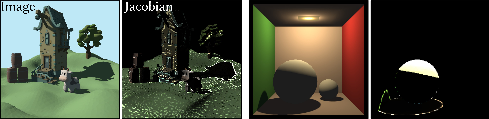

# 

  <h1 align="center"><a href="https://mworchel.github.io/differentiable-shadow-mapping">Differentiable Shadow Mapping for Efficient Inverse Graphics</a></h1>

  

  

    <i>IEEE/CVF Conference on Computer Vision and Pattern Recognition (CVPR) 2023</i>
     
    <a href="https://github.com/mworchel"><strong>Markus Worchel</strong></a>
    ·
    <a href="https://www.cg.tu-berlin.de/team/prof-dr-marc-alexa/"><strong>Marc Alexa</strong></a>
  

